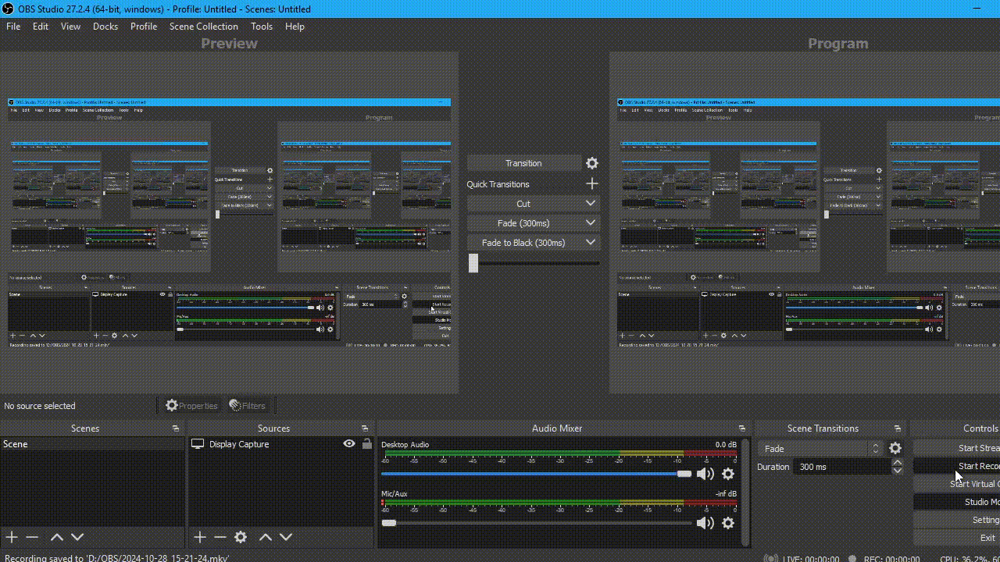

# Python Task Manager dengan Flask

Ini adalah aplikasi Task Manager sederhana berbasis web yang dibuat dengan Python dan Flask.
Script ini hanya bisa dijalankan pada system windows saja, untuk linux, mac os, android itu belum bisa!

## Fitur
- Menampilkan penggunaan CPU dan RAM secara real-time.
- Menunjukkan informasi perangkat.

## Persyaratan
- Testing: Windows 10
- Python 3.x
- Liblary yang digunakan:
  - Flask
  - psutil

## Instalasi
1. Clone Repository:
   ```bash
   git clone https://github.com/SyhrlmyZID/project-task-manager.git

2. Masuk Ke Repository:
   ```bash
   cd project-task-manager

3. Jakankan Script:
   ```bash
   python app.py

4. Jika ada keterangan output pada script tersebut copy url nya dan jalankan di web browser
   

